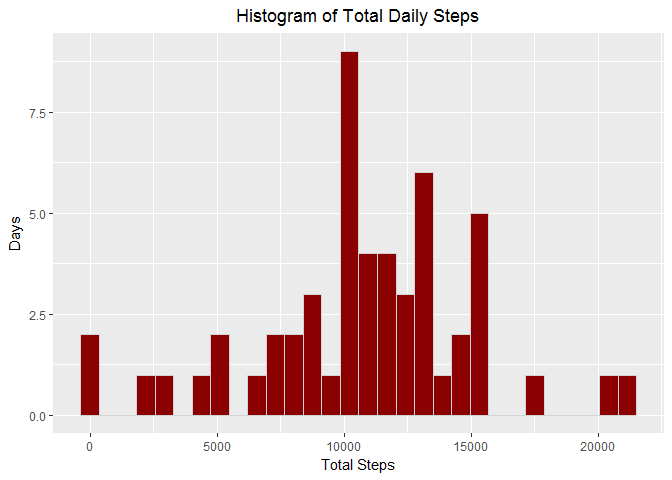
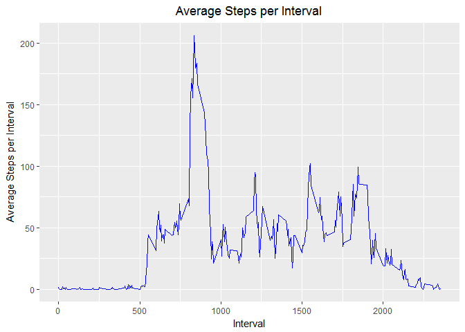
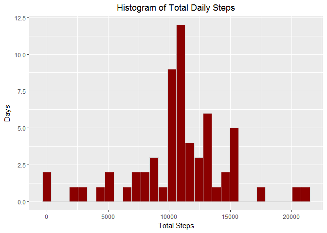
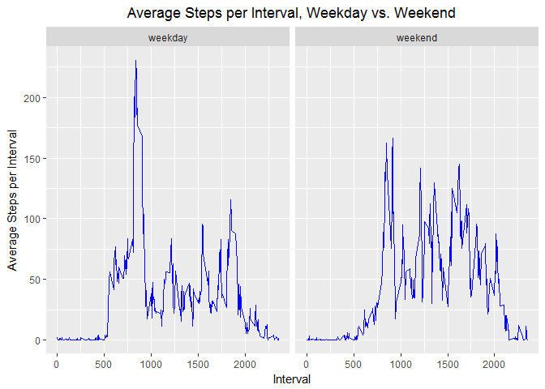

Introduction
------------

This assignment makes use of data from a personal activity monitoring
device. This device collects data at 5 minute intervals through out the
day. The data consists of two months of data from an anonymous
individual collected during the months of October and November, 2012 and
include the number of steps taken in 5 minute intervals each day.

Loading and preprocessing the data
----------------------------------

First, the data for this assignment was downloaded from the course web
site, processed to filter out N/A values and summarized by total steps
per day.

    library(dplyr)
    library(ggplot2)
    library(xtable)
    library(lubridate)

    path <- "https://d396qusza40orc.cloudfront.net/repdata%2Fdata%2Factivity.zip"
    temp <- tempfile()
    download.file(path, temp)
    activity <- read.csv(unz(temp, "activity.csv"))
    unlink(temp)

Calculating mean total number of steps taken per day
----------------------------------------------------

This section calculates the total number of steps taken per day. The
following plot shows the total steps taken each day and the table
summarizes the average and median total steps per day.

    graph <- activity[!is.na(activity$steps), ]
    graph <- graph %>% group_by(date) %>% summarize(tot_steps = sum(steps))

    par(mfrow = c(1, 1))

    g <- ggplot(data = graph, aes(x = tot_steps)) 
    g <- g + labs(x = "Total Steps", y = "Days", title = "Histogram of Total Daily Steps")
    g <- g + geom_histogram(fill = "darkred", color = "lightgray") 
    g + theme(plot.title = element_text(hjust = 0.5))

    # Calculate mean and median
    t <- graph %>% summarize(mean_steps = mean(tot_steps), median_steps = median(tot_steps))
    colnames(t) <- c("Mean Steps", "Median Steps")
    print(xtable(t), type = "html", html.table.attributes = "border=1")

<!-- html table generated in R 3.4.2 by xtable 1.8-2 package -->
<!-- Sun Dec 10 23:26:39 2017 -->
<table border="1">
<tr>
<th>
</th>
<th>
Mean Steps
</th>
<th>
Median Steps
</th>
</tr>
<tr>
<td align="right">
1
</td>
<td align="right">
10766.19
</td>
<td align="right">
10765
</td>
</tr>
</table>
Calculate the average daily activity pattern
--------------------------------------------

This section plots for each 5-minute interval the average number of
steps for all days in the dataset and summarizes the maximum average
number of steps, along with the corresponding interval associated with
this maximum.

    graph <- activity %>% group_by(interval) %>% summarize(avg_steps = mean(steps, na.rm = TRUE))

    g <- ggplot(data = graph, aes(x = interval, y = avg_steps)) 
    g <- g + geom_line(color = "blue")
    g <- g + labs(x = "Interval", y = "Average Steps per Interval", title = "Average Steps per Interval")
    g + theme(plot.title = element_text(hjust = 0.5))

    t <- graph[graph$avg_steps == max(graph$avg_steps), ]
    colnames(t) <- c("Interval", "Max Steps")
    print(xtable(t), type = "html", html.table.attributes = "border=1")

<!-- html table generated in R 3.4.2 by xtable 1.8-2 package -->
<!-- Sun Dec 10 23:26:41 2017 -->
<table border="1">
<tr>
<th>
</th>
<th>
Interval
</th>
<th>
Max Steps
</th>
</tr>
<tr>
<td align="right">
1
</td>
<td align="right">
835
</td>
<td align="right">
206.17
</td>
</tr>
</table>
Impute missing values
---------------------

This section calculates and reports on the total number of missing
values in the dataset, uses the average number of steps per interval to
impute these missing values, creates a new dataset that is equal to the
original dataset but with the missing data filled in, makes a histogram
of the total number of steps taken each day and calculates and reports
the mean and median total number of steps taken per day.

    # Calculate and report the total number of missing values in the dataset 
    r <- nrow(activity[is.na(activity$steps), ])

    # Devise a strategy for filling in all of the missing values in the dataset
    # Create a new dataset that is equal to the original dataset but with the missing data filled in
    new_act <- activity
    new_act$missing = is.na(new_act$steps)
    new_act[is.na(new_act$steps), ]$steps = graph[graph$interval %in% new_act$interval, ]$avg_steps

    # Make a histogram of the total number of steps taken each day 
    graph <- new_act
    graph <- graph %>% group_by(date) %>% summarize(tot_steps = sum(steps))

    g <- ggplot(data = graph, aes(x = tot_steps)) 
    g <- g + geom_histogram(fill = "darkred", color = "lightgray") 
    g <- g + labs(x = "Total Steps", y = "Days", title = "Histogram of Total Daily Steps")
    g + theme(plot.title = element_text(hjust = 0.5))

    # Calculate and report the mean and median total number of steps taken per day
    t <- graph %>% summarize(mean_steps = mean(tot_steps), median_steps = median(tot_steps))
    colnames(t) <- c("Mean Steps", "Median Steps")
    print(xtable(t), type = "html", html.table.attributes = "border=1")

<!-- html table generated in R 3.4.2 by xtable 1.8-2 package -->
<!-- Sun Dec 10 23:26:42 2017 -->
<table border="1">
<tr>
<th>
</th>
<th>
Mean Steps
</th>
<th>
Median Steps
</th>
</tr>
<tr>
<td align="right">
1
</td>
<td align="right">
10766.19
</td>
<td align="right">
10766.19
</td>
</tr>
</table>
Determine differences in activity patterns between weekdays and weekends
------------------------------------------------------------------------

This section creates a new factor variable in the data set with two
levels - "weekday" and "weekend" and makes a panel plot containing a
time series plot of the 5-minute interval (x-axis) and the average
number of steps taken, averaged across all weekday days or weekend days
(y-axis).

    # Create a new factor variable in the dataset with two levels - "weekday" and "weekend" 
    # indicating whether a given date is a weekday or weekend day

    new_act$day = weekdays(as.Date(as.character(new_act$date)))
    new_act$daytype = "weekday"
    new_act[wday(new_act$date, week_start = 1) > 5, ]$daytype = "weekend"
    new_act$daytype <- as.factor(new_act$daytype)

    graph <- new_act
    graph <- graph %>% group_by(interval, daytype) %>% summarize(avg_steps = mean(steps))

    g <- ggplot(data = graph, aes(x = interval, y = avg_steps)) 
    g <- g + facet_grid(facets = .~daytype) + geom_line(color = "blue") 
    g <- g + labs(x = "Interval", y = "Average Steps per Interval", 
         title = "Average Steps per Interval, Weekday vs. Weekend")
    g + theme(plot.title = element_text(hjust = 0.5))

